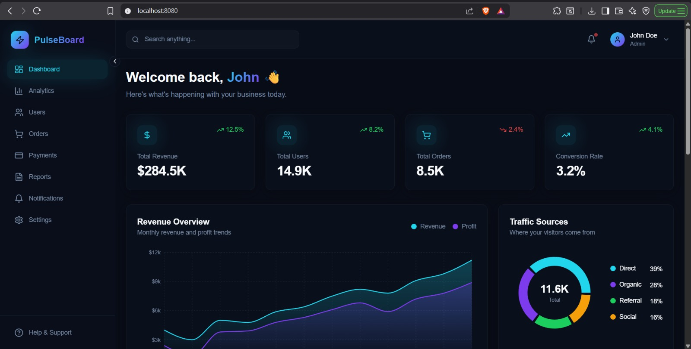
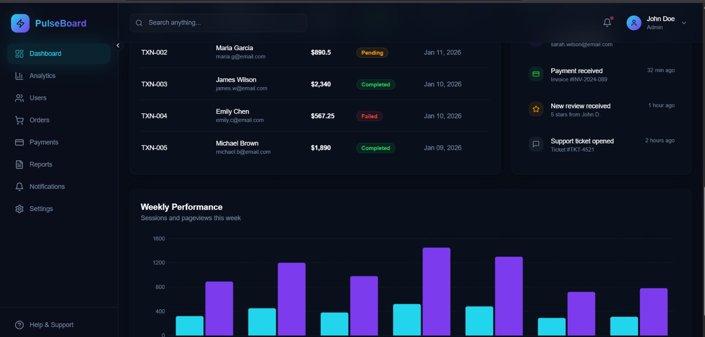
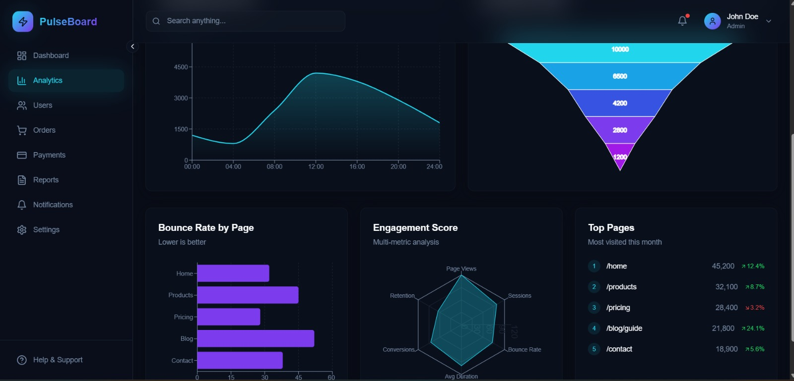
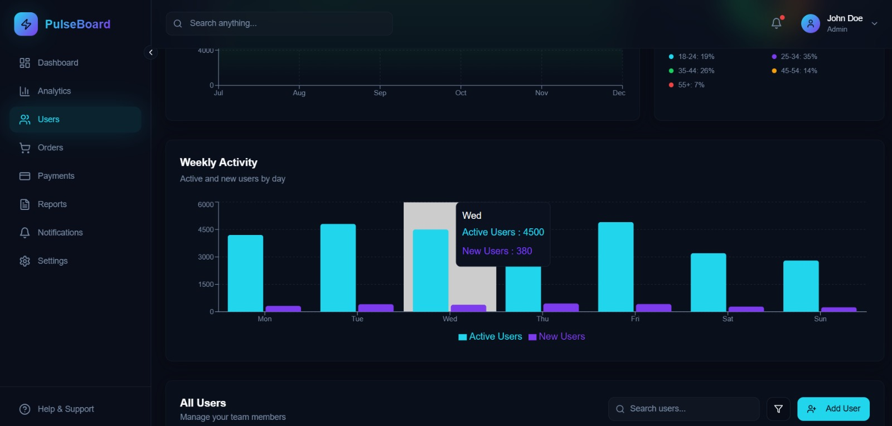

# PulseBoard - Visual Analytics Dashboard

A modern, visually impressive analytics dashboard built with React, featuring real-time data visualizations, glassmorphism effects, and smooth animations.


## 📸 Dashboard Snapshots

<p align="center">
  
  
</p>

<p align="center">
  
  
</p>


## ✨ Features

- **📊 Interactive Charts** - Revenue trends, traffic sources, performance metrics using Recharts
- **🎨 Modern UI** - Dark theme with glassmorphism effects and gradient accents
- **📱 Responsive Design** - Works seamlessly on desktop and mobile devices
- **⚡ Smooth Animations** - Staggered animations and micro-interactions
- **📈 Multiple Dashboard Pages**:
  - **Overview** - Key metrics, revenue charts, activity feed
  - **Analytics** - Real-time views, conversion funnels, engagement radar
  - **Users** - Demographics, growth trends, user activity
  - **Orders** - Revenue breakdown, order status, category performance

## 🛠️ Tech Stack

- **React 18** - UI Framework
- **TypeScript** - Type Safety
- **Vite** - Build Tool
- **Tailwind CSS** - Styling
- **Recharts** - Data Visualizations
- **shadcn/ui** - UI Components
- **React Router** - Navigation
- **Lucide Icons** - Icon Library

## 🚀 Getting Started

### Prerequisites

- Node.js 18+ installed ([install with nvm](https://github.com/nvm-sh/nvm#installing-and-updating))
- npm or bun package manager

### Installation

```bash
# Clone the repository
git clone <YOUR_GIT_URL>

# Navigate to project directory
cd <YOUR_PROJECT_NAME>

# Install dependencies
npm install

# Start development server
npm run dev
```

The app will be available at `http://localhost:8080`

### Build for Production

```bash
npm run build
```

## 📁 Project Structure

```
src/
├── components/
│   ├── dashboard/
│   │   ├── ActivityFeed.tsx      # Recent activity list
│   │   ├── Header.tsx            # Top navigation bar
│   │   ├── PerformanceChart.tsx  # Bar chart component
│   │   ├── RevenueChart.tsx      # Area chart component
│   │   ├── Sidebar.tsx           # Navigation sidebar
│   │   ├── StatCard.tsx          # Metric cards
│   │   ├── TrafficChart.tsx      # Pie chart component
│   │   └── TransactionsTable.tsx # Data table
│   └── ui/                       # shadcn/ui components
├── pages/
│   ├── Index.tsx                 # Overview dashboard
│   ├── Analytics.tsx             # Analytics page
│   ├── Users.tsx                 # Users management
│   └── Orders.tsx                # Orders tracking
├── hooks/                        # Custom React hooks
├── lib/                          # Utility functions
└── index.css                     # Global styles & design tokens
```

## 🎨 Design System

The project uses a custom dark theme with:

- **Primary**: Purple gradient (#7c3aed → #a855f7)
- **Accent**: Cyan highlights (#22d3ee)
- **Background**: Deep slate tones
- **Glass Effects**: Backdrop blur with transparency

## 📜 Available Scripts

| Command | Description |
|---------|-------------|
| `npm run dev` | Start development server |
| `npm run build` | Build for production |
| `npm run preview` | Preview production build |
| `npm run lint` | Run ESLint |

## 🤝 Contributing

1. Fork the repository
2. Create a feature branch (`git checkout -b feature/amazing-feature`)
3. Commit changes (`git commit -m 'Add amazing feature'`)
4. Push to branch (`git push origin feature/amazing-feature`)
5. Open a Pull Request

## 📄 License

This project is open source and available under the MIT License.


